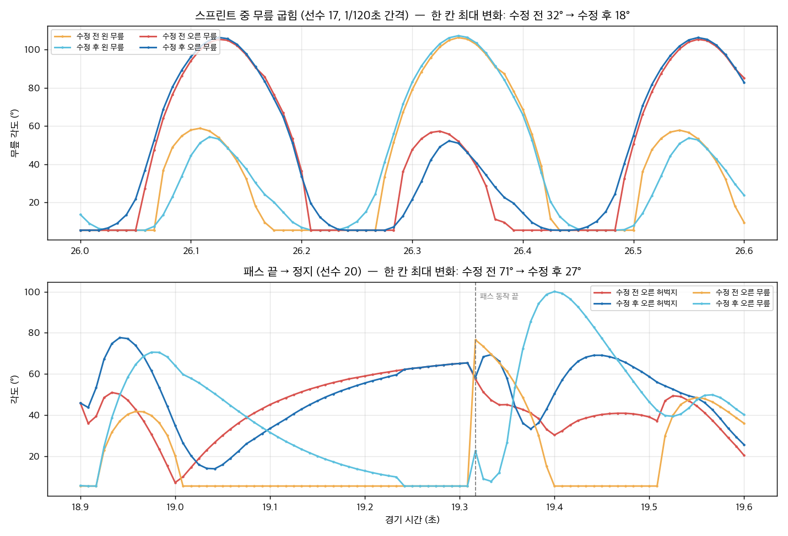

# 관절 튐 수정 (fix/motion-pops)

모캡(B 리그)을 넣기 전에, 발 IK와 상태 판정 때문에 생기는 관절 튐을 먼저 줄인 기록입니다. 2번(애니메이션) 담당 파일이 대부분이라 검토 요청용으로 정리했습니다.

## 측정 조건

- 기준: main `e40fa61`
- AI 11대11, seed 5, 60초, 1/120초마다 22명 × 13관절의 최종 회전 기록 (IK 적용 후 값)
- 카메라 거리는 실제 게임과 같게 설정: 조작 선수만 contactDetail, 나머지는 원거리 LOD
- 튐 기준: 한 칸(1/120초)에 15° 이상(초당 1800° 이상)이면서, 앞뒤 3칸 변화량 중앙값의 3배 이상
- 원인 분류: 그 칸에 상태나 동작이 바뀌었는지, 모캡 조건이 바뀌었는지, 그리고 IK 전 자세에도 같은 튐이 있는지(pose) 없는지(ik)로 나눔
- 측정 도구(`qa-local/joint-log.mjs`)는 커밋하지 않은 로컬 전용 파일입니다.

## 결과

| 원인 | 수정 전 | 1a | 1b | 1c | 2 | 3 | 4 | 5 | 최종 |
|---|---|---|---|---|---|---|---|---|---|
| 1 발 뗄 때 무릎 (IK) | 3,520 | 2,542 | 1,633 | 428 | 429 | 415 | 457 | 454 | **454** |
| 2 슛·패스 전후 | 272 | 111 | 111 | 123 | 73 | 73 | 70 | 69 | **49** |
| 3 모캡 켜고 끄기 | 644 | 629 | 632 | 630 | 630 | 262 | 264 | 264 | **264** |
| 4 상태 전환 순간 | 472 | 476 | 691 | 502 | 502 | 503 | 442 | 442 | **442** |
| 5 기타 자세 | 400 | 207 | 655 | 346 | 347 | 357 | 386 | 378 | **378** |
| **합계** | **5,308** | 3,965 | 3,722 | 2,029 | 1,981 | 1,610 | 1,619 | 1,607 | **1,587 (-70%)** |

| 기타 지표 | 수정 전 | 수정 후 |
|---|---|---|
| 0.15초 안에 A→B→A로 돌아오는 상태 전환 | 2,277 | 11 |
| 디딤발 높이 p95 (땅에서 뜬 정도) | 6.5 cm | 2.6 cm |
| 패스 임팩트 순간 발-공 목표 거리 (4회) | 6.8 / 19.9 / 7.9 / 7.0 cm | 6.8 / 19.9 / 7.9 / 7.0 cm (같음) |
| 스프린트 무릎 한 칸 최대 변화 (선수 17) | 32° | 23° (스윙 속도 자체, 튐 아님) |
| 패스 끝 다리 한 칸 최대 변화 (선수 20) | 71° | 28° |

## 파일별 변경

### src/foot-plant.js (2번)

1. **발 최종 위치 관성 블렌딩** `inertializeFeet` (1a)
   - 관절 회전의 관성 블렌딩(`InertialJoint`)은 IK보다 먼저 돌기 때문에, IK가 다리를 다시 풀면서 블렌딩이 없어졌습니다.
   - IK가 끝난 뒤 발 위치에 관성 블렌딩을 한 번 더 겁니다. 다음 두 경우에 직전 발 위치와 속도에서 이어서 새 위치로 수렴시킵니다.
     - 상태·동작·접지 모드가 바뀔 때
     - 한 칸 속도가 22 m/s를 넘을 때
   - 발 위치는 IK로 다시 풀어서 다리 길이를 지킵니다.
2. **발 떼기 전 IK 무게 줄이기** (1b)
   - 이전에는 디딤발을 다리가 다 펴질 때까지 붙잡고 있다가 한 번에 놓았습니다.
   - 이제 걸음 주기상 발 떼기, 또는 다리 길이 한계 중 먼저 오는 쪽의 0.075초 전부터 고정 무게를 1에서 0으로 줄여, 애니메이션 발 위치로 넘깁니다.
3. **소프트 IK** `softReach` (1c)
   - 다리가 다 펴지기 직전에는 목표가 1 cm만 움직여도 무릎이 약 19° 변합니다.
   - 스프린트에서는 목표가 다리 길이 밖에 있어서 무릎이 몇 프레임 동안 완전히 펴진 채 멈춰 있다가, 목표가 안으로 들어오는 순간 30° 넘게 꺾였습니다.
   - 이제 걷기·달리기에서는 다리 길이 끝 4 cm 구간을 지수 곡선으로 부드럽게 만듭니다.
   - 디딤발이 뜨지 않도록, 골반을 낮추는 기준 길이를 1.6 cm 줄였습니다.
4. **공 접촉 IK 곡선** (2)
   - 이전에는 킥 발을 임팩트 ±0.055초 동안만 공 위치로 순간 이동시켰습니다.
   - 이제 임팩트 0.125초 전부터 곡선으로 올리고, 끝난 뒤 0.18초에 걸쳐 내립니다.
   - 내릴 때 목표 위치는 **몸 기준 좌표**로 고정합니다. 월드 좌표로 두면 계속 달리는 선수의 다리가 공이 있던 자리 뒤로 끌려갔습니다.
   - 관성 블렌딩 보정도 같은 곡선으로 0까지 줄여서, 임팩트 순간 발-공 거리는 수정 전과 같습니다.
   - 볼 받기 IK 무게(최대 0.72)도 접촉 0.1초 전부터 올립니다. 이전에는 0에서 바로 올라갔고, 다리가 닿는 거리 경계에서도 켜짐·꺼짐 대신 6 cm에 걸쳐 바뀝니다.

### src/motion.js (2번)

1. **모캡 무게값** (3)
   - `forward > speed*0.65`로 켜고 끄던 달리기 모캡을 무게값 `captureTarget`으로 바꿨습니다.
   - 앞으로 가는 비율이 0.5이면 0, 0.8이면 1입니다.
   - 실제로 쓰는 값은 `kinematics.capture`이고, player.js가 0.2초에 걸쳐 따라가게 만듭니다.
   - 방향 전환 때 몸을 기울이는 양(`torso[2]`)도 같은 무게로 곱합니다.
2. **상태 히스테리시스** (4)

   | 상태 | 들어가는 기준 | 나오는 기준 |
   |---|---|---|
   | start | 가속 4.5 | 3.0 |
   | stop | 감속 4.5 | 3.0 |
   | turn | 회전 3.0 | 2.2 |
   | backpedal | -0.3 | -0.15 |
   | sprint | 6.0 m/s | 5.6 m/s |
   | keeper-step | 0.5 m/s | 0.35 m/s |

3. **최소 유지 0.15초** (4)
   - 이동 계열 상태(`HELD_STATES`)는 바뀐 지 0.15초가 안 되면 이전 상태 이름을 유지합니다.
   - 자세 공식은 원래 연속값이라, 이 규칙은 이름(관성 블렌딩 키)에만 적용됩니다.
   - 볼 받기, 턴 계획, 동작 같은 상태는 대상이 아니라서 그대로 바로 바뀝니다.
4. **걷기 클립 위상** (5)
   - CMU 16_15 걷기 클립은 오른발 0.02, 왼발 0.61에서 착지합니다. 조깅·달리기 클립(왼발 0.04/0.98, 오른발 0.54/0.50)과 반 걸음 어긋나 있어서, 0.55주기만큼 밀었습니다. 남는 차이는 양발 각각 0.05입니다.

### src/player.js (1번)

- `sampleMotion`에 다음 값을 넘깁니다.
  - `capture`: 모캡 무게를 0.2초에 걸쳐 따라가게 만든 값
  - `state` / `stateAge`: 직전 상태와 유지 시간
- `stabilizeFeet` 뒤에 `inertializeFeet`를 호출합니다.

## 알게 된 점과 남은 한계

- **4번(상태 왔다갔다)**
  - 짧은 A→B→A 전환은 2,277번에서 11번으로 줄었지만, 튐 횟수는 472번에서 442번으로 거의 그대로입니다.
  - 상태 이름이 바뀌는 것 자체는 튐의 원인이 아니었습니다. 자세 공식이 연속값이고, 관성 블렌딩은 현재 출력에서 다시 시작하기 때문입니다.
  - 요청에 있던 "A→B→A면 블렌딩을 처음부터 다시 시작하지 않기"는 따로 구현하지 않았습니다. 현재 방식도 출력 위치에서 이어서 시작해서 이미 끊김이 없고, 최소 유지 시간 때문에 그런 전환 자체가 거의 생기지 않기 때문입니다.
- **5번(걷기 위상)**
  - 걷기 중에는 발 IK가 다리 회전을 매 프레임 덮어써서, 클립의 다리 동작은 화면에 나오지 않습니다.
  - 그래서 위상을 맞춰도 다리 지표 변화는 측정되지 않았습니다(29.9° → 29.8°). 영향은 골반·상체·팔 위상에만 있습니다.
  - B 리그 단계에서 클립 다리를 쓰려면 이 구조를 같이 봐야 합니다.
- **남은 튐 1,587번 중 큰 것**
  - 볼 받기(`receive-prepare`, `receive-redirect`) 때 발목이 50~63° 튀는 현상
  - 어깨 싸움 중 팔 튐
  - 상태가 바뀔 때 생기는 IK 튐: `start→sprint`, `sprint→stop`
- **보이는 부작용**
  - 공이 몸 뒤쪽에 있는 패스(선수 20, 19.3초)는 수정 전에도 다리를 뒤로 뻗습니다.
  - 수정 후에는 동작이 끝날 때 다리가 한 번에 돌아오지 않고 0.18초에 걸쳐 돌아와서, 뒤로 뻗은 다리가 조금 더 오래 보입니다.

## 검사

- `node --test --experimental-test-isolation=none tests/*.test.mjs`: 256/256 통과
- `node tools/build-web.mjs`: 통과

## 남은 1,587번 원인 분석 (2026-09-26, 수정 없이 분석만)

같은 조건(AI 11대11, 60초, seed 5, 15° 기준)으로 다시 쟀습니다. 이번에는 튐마다 다음 값을 같이 기록했습니다: 직전·직후 상태, 동작, 접지 모드, 골반 높이, 골반 낮추기 보정(`hipCorrection`), 발 고정 시작·해제, IK 전 자세의 무릎 각도, 발 위치 관성 블렌딩이 다시 걸렸는지, 앞으로 가는 비율(forward/speed). 대표 순간은 프레임 단위로 추적해서 확인했습니다.

### 실제 원인별 개수

| 원인 | 개수 | 주로 나는 곳 | 확인 방법 |
|---|---|---|---|
| A. 착지 순간 골반 높이 급변 | 552 | 무릎 476, start/stop/run/sprint | 추적 확인 |
| B. 발 보정 재계산 때 소프트 IK 이중 적용 (**이번 수정이 만든 것**) | 299 | 무릎 225, 발목 73 | 추적 확인 |
| C. 팔 흔들기 켜짐/꺼짐 (`forward > 0.65×speed`) | 261 | 팔 261, 턴 중 | 추적 확인 |
| I. 걸음 IK 기타 | 279 | 무릎, 중앙값 16° (기준선 15° 근처) | 원인 미확인 |
| E. 볼 받기 | 59 | 발목·무릎, receive-prepare | 분류만 |
| D. 슛·패스 동작 중 | 29 | pass·lob·through | 분류만 |
| G. 턴 계획 자세 | 29 | 머리 | 분류만 |
| F. 어깨 싸움 | 28 | 무릎·팔 | 분류만 |
| H. 골키퍼 | 13 | keeper-ready/step | 분류만 |
| J. 자세 공식 기타 | 38 | 머리 25 | 분류만 |

**A. 착지 순간 골반 높이 급변 (552)** — 원인이 두 겹입니다.
- 걸음 공식 쪽(`gait.js`의 `gaitTargets`)
  - 골반 목표 높이는 "땅에 닿은 발까지 다리가 닿는 높이" 이하로 제한됩니다.
  - 전력질주에서 공중에 떴다가 앞발이 닿는 순간, 이 제한이 생기면서 목표 높이가 한 프레임에 7.6 cm 떨어집니다(선수 13, 43.83초: 0.862 → 0.786 m).
  - 그래서 IK 전 자세의 무릎이 49.8° → 75.7°로 튑니다.
- 발 고정 쪽(`foot-plant.js`의 `hipCorrection`)
  - 이 보정은 내려갈 때는 천천히, **올라갈 때는 한 번에** 바뀝니다(`Math.max(desired, 이전값×감쇠)`).
  - 발이 닿는 프레임에 0.4 cm → 4.5 cm로 바로 올라가서, 골반이 1/120초에 5.6 cm 떨어집니다(선수 4, 4.38초).
  - 발은 관성 블렌딩이 제자리에 붙잡고 있어서 무릎이 7° → 50°로 꺾입니다.

**B. 소프트 IK 이중 적용 (299) — 이번 수정이 만든 튐**
- `inertializeFeet`는 보정이 2 mm를 넘으면 발을 IK로 다시 풉니다. 이때 소프트 IK를 한 번 더 적용합니다.
- 다리가 거의 펴진 상태에서는 이미 짧아진 목표를 또 줄이게 되고, 발은 거의 그대로인데 무릎이 31° 꺾입니다(선수 14, 25.80초: 5.4° → 36.8°).
- 상태 이름이 바뀌면 이 보정이 다시 걸리기 때문에, 튐이 상태 전환 순간에 몰립니다. 그 결과 "상태 전환 순간 무릎" 유형이 수정 전 114번에서 259번으로, 발목은 19번에서 78번으로 늘었습니다.

**C. 팔 흔들기 켜짐/꺼짐 (261)**
- 1-3에서 모캡 블록만 무게값으로 바꾸고, `motion.js`의 팔 흔들기 블록(`forward>speed*.65&&speed>1.2`)은 켜짐/꺼짐으로 남아 있습니다.
- 턴 중 비율이 0.65를 지나는 순간(0.68 → 0.64) IK 전 자세의 팔이 한 프레임에 약 25° 바뀝니다(선수 18, 16.03초).

### 1-1·1-3·1-4 질문에 대한 답

- **1-4 상태 전환 442번**: 상태 전환 자체가 원인이 아닙니다. B가 290번, A(착지가 같은 프레임에 겹침)가 151번입니다. 상태 이름이 바뀌면 발 보정이 다시 걸리는데, 그때 B의 이중 소프트 IK가 드러납니다.
- **1-1 무릎 454번**(측정 도구의 "IK 걸음" 분류): I 279, A 83, 볼 받기 46, 어깨 싸움 19, 골키퍼 9, 턴 9, B 9입니다.
- **1-3 모캡 264번**: 261번이 C(팔 흔들기 켜짐/꺼짐)입니다. 모캡 무게값 수정과는 다른 조건입니다.
- **새로 생긴 유형**: B(299번)입니다. 다른 유형은 전부 수정 전보다 줄었습니다. 늘어난 것은 걸음 IK 중 고관절(5 → 17)처럼 개수가 작은 것뿐입니다.

### 모션 매칭(6단계)으로 없어질 것 vs 따로 고쳐야 할 것

| 원인 | 6단계로 없어짐? | 이유와 할 일 |
|---|---|---|
| A 걸음 공식 쪽 (IK 전 자세) | 대부분 | 골반 높이를 공식 대신 모캡 클립이 정하게 됨 |
| A 발 고정 쪽 (`hipCorrection`) | 아니요 | 발 고정 IK는 6단계에도 남음. 올라갈 때도 0.05~0.08초에 걸쳐 따라가게 고쳐야 함 |
| B 소프트 IK 이중 적용 | 아니요 | 보정 재계산 때 소프트 IK를 빼거나, 소프트를 적용하기 전 목표에 보정을 더해야 함. **이 PR 안에서 고치는 게 맞음** |
| C 팔 흔들기 켜짐/꺼짐 | 예 | 공식 팔 흔들기가 모캡으로 대체됨. 그 전에 1-3과 같은 무게값으로 바꾸는 건 간단함 |
| G 턴 계획, J 자세 공식 | 예 | 턴과 정지 동작이 클립에서 나옴 |
| I 걸음 IK 기타 | 일부 | 발 고정 IK는 남음. 원인을 먼저 확인해야 함 |
| D 슛·패스, E 볼 받기 | 아니요 → 7단계 | 공 다루는 클립과 임팩트 IK |
| F 어깨 싸움 | 아니요 → 9단계 | 물리 반응 |
| H 골키퍼 | 아니요 → 7단계 | 골키퍼 클립 |

측정 원본(튐마다 기록한 값)은 로컬 도구로 만든 것이라 저장소에 넣지 않았습니다. 같은 조건으로 다시 잴 수 있습니다.
