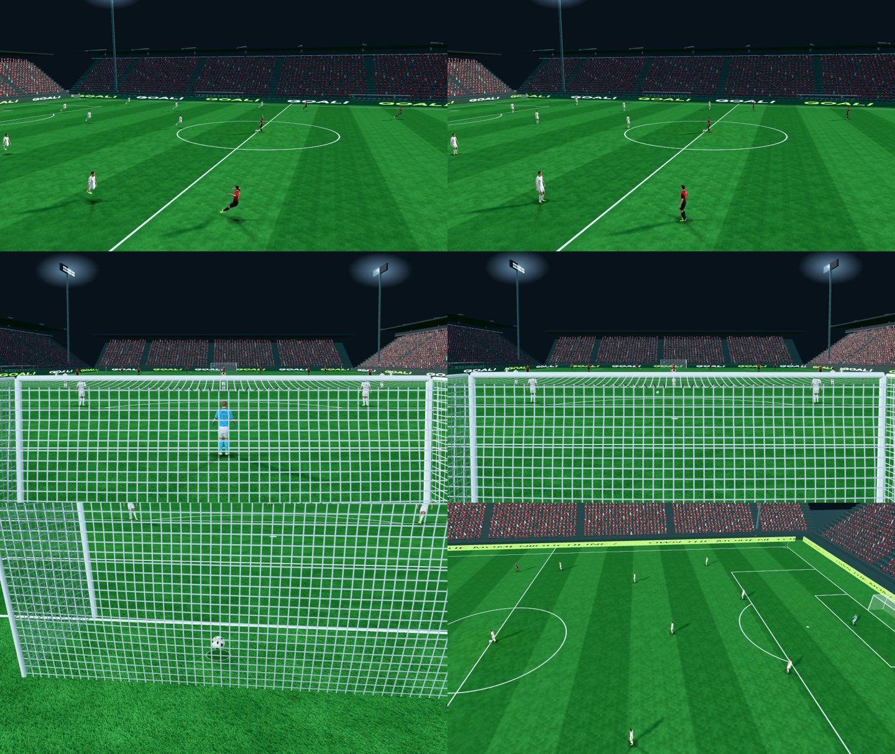

# 중계 화면 3차: 골 리플레이 앵글 · LED 광고판

담당 05번 파일(`src/camera.js`, `src/main.js`, `src/stadium.js`, `index.html`, `style.css`)만 변경.

## 골 리플레이

이전: 가까운 카메라 한 대로 0.75배속 따라가기.

이후 (5 s 재생, 0.75배속은 그대로):

| 구간 | 카메라 | 위치 |
|---|---|---|
| 0–2.6 s | 반대편 터치라인 낮은 앵글, 빌드업을 따라감 | z = −39(광고판과 스탠드 사이), 높이 7 m |
| 2.6 s 컷 | 골대 뒤 낮은 앵글, 그물 너머로 마무리 | x = ±59.5(광고판 58 m와 스탠드 62 m 사이), 높이 2.8 m |

- 앵글이 바뀔 때 컷과 대각선 와이프(0.42 s, CSS)를 넣었습니다. 움직임 줄이기 설정을 켠 사용자에게는 와이프가 나오지 않습니다.
- 리플레이가 끝나면 중계 카메라로 바로 컷합니다(28 m/s로 날아오지 않음).
- 검사: 앵글 전환·카메라 위치(스탠드 밖)·공이 화면 안에 있는지·끝난 뒤 컷을 양쪽 골대에서 확인합니다.

## LED 광고판

- 경기 중에는 광고 띠가 천천히 흐릅니다.
- 골이 들어가면 "GOAL!" 띠로 바뀌어 빠르게 흐르고 밝기가 맥박처럼 번쩍입니다.
- 야간에는 LED 밝기가 더 높습니다(0.62, 낮 0.28).
- 추가 draw call이나 텍스처 로딩은 없습니다(2048×128 캔버스 1장 추가).

왼쪽 위부터: 골 직후 GOAL 광고판 → 반대편 앵글 두 장 → 컷 후 골대 뒤 → 그물에 꽂히는 공 → 리플레이 뒤 킥오프 중계 화면. 캡처에서는 공을 골문 앞에 직접 놓아 골을 만들었기 때문에, 리플레이 앞부분은 그 전 플레이입니다.
