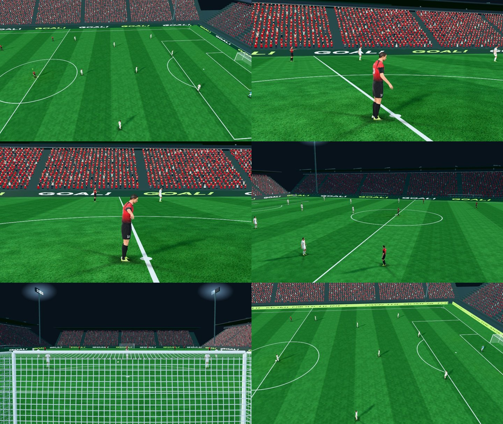

# 중계 화면 4차: 선수 화면 밖 컬링 · 골 세리머니 카메라 · 팀별 관중 반응

담당 05번 파일(`src/main.js`, `src/camera.js`, `src/stadium.js`)만 변경. 선수 파일(`human-body.js` 등)은 건드리지 않았습니다.

## 선수 화면 밖 컬링 (성능)

- 문제: 선수 스킨 메시는 `frustumCulled=false`라(뼈를 따라가지 않는 경계 때문) 22명 전원을 본 패스와 그림자 패스에서 매 프레임 그렸습니다. M4 Air에서 선수가 한 프레임 비용의 약 59%였습니다.
- 변경: 렌더 직전 현재 카메라 시야에서 여유 5 m 밖에 있는 선수의 `rig.root`만 숨깁니다. 5 m는 야간 조명탑 그림자(최대 약 4.5 m)가 화면 안으로 들어오는 경우까지 덮습니다. 애니메이션은 매 프레임 계속 돌려서, 다시 화면에 들어올 때 자세가 튀지 않습니다.
- 측정(AI 경기 3시드 × 90 s, 중계 카메라): 화면 밖 선수가 프레임당 평균 4.2명(p50 4, p90 8)이므로 선수 그리기가 평균 약 19% 줄어듭니다. 줌을 가깝게 하면 더 줄어듭니다.

## 골 세리머니 카메라

- 골 후 1.2 s는 와이드 중계 화면 그대로 공이 그물에 들어간 장면을 보여줍니다.
- 그다음 득점자를 6.2 m 거리, 높이 1.9 m에서 천천히 도는 클로즈업으로 컷합니다(FOV 32°, 약 3.8 s).
- 이어서 리플레이 두 앵글로 넘어가고, 끝나면 중계 화면으로 컷합니다. 카메라는 광고판 안쪽에 머뭅니다(|x| ≤ 57, |z| ≤ 37).

## 팀별 관중 반응

- 홈 스탠드와 원정 끝 스탠드의 흥분도를 따로 움직입니다. 골을 넣은 쪽만 일어나 팔을 들고 들썩이고, 반대쪽은 가라앉습니다.
- 경기 중 공격 3분의 1 긴장감은 양쪽 모두에 그대로 적용됩니다.

왼쪽 위부터: 골 직후 와이드 → 득점자 클로즈업 2장(뒤쪽 홈 관중이 일어나 환호) → 리플레이 반대편 앵글 → 골대 뒤 앵글 → 리플레이 뒤 킥오프 중계 화면. 캡처에서는 공을 골문 앞에 직접 놓아 골을 만들어서 득점자가 서 있습니다. 실제 골에서는 세리머니 동작이 나옵니다.
