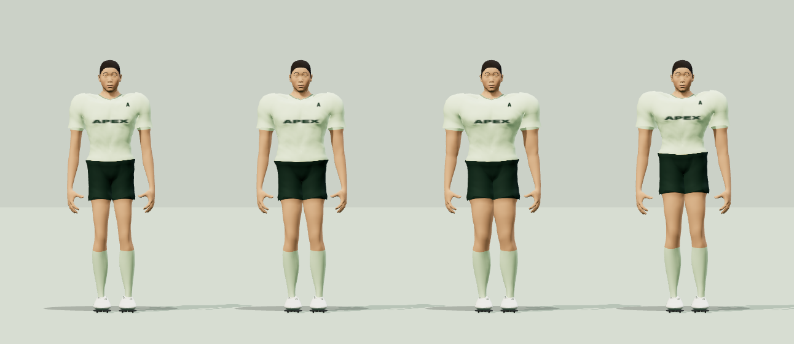
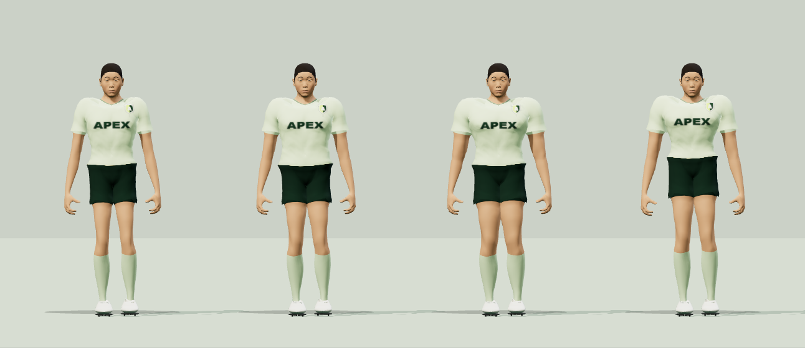
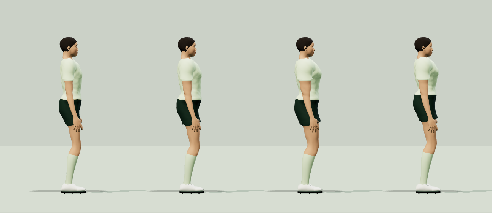
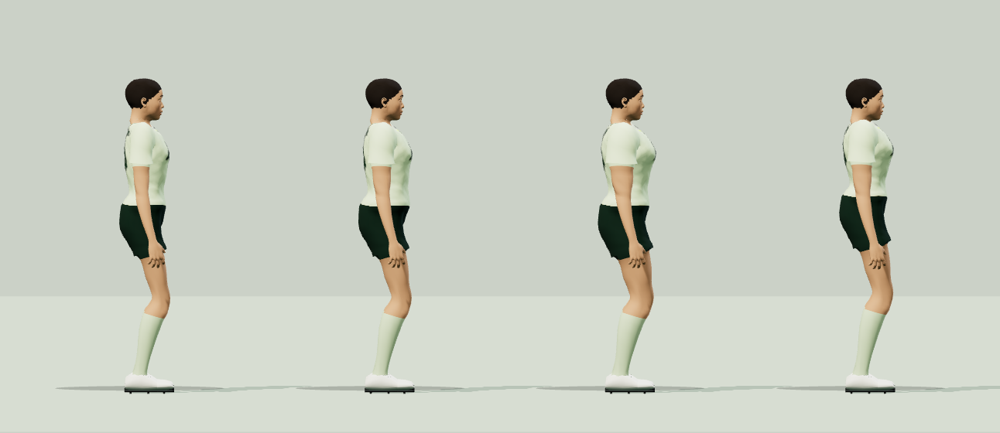
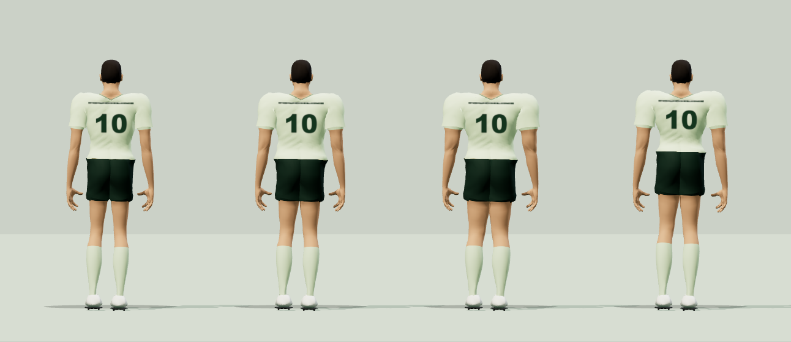
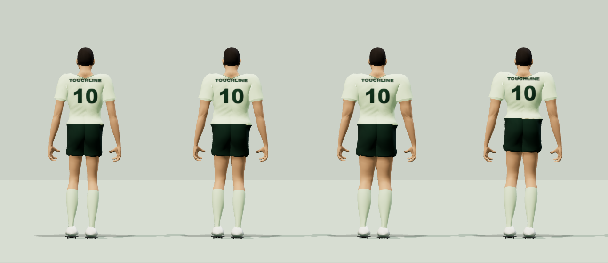

# 선수 표현·11대11 경기 개선 / 2026-09-26

기준 소스는 공개 main `aa6faf6`입니다. 공개 사이트 메뉴와 실제 경기를 먼저 열어 방향 이동, 질주, 패스, 스루패스를 조작했습니다. 이후 해당 커밋의 별도 복사본과 작업 브랜치를 서로 다른 로컬 Origin에서 비교했습니다. EA 자산이나 코드는 추가하지 않았습니다.

업로드 준비 중 원격 main의20개 새 커밋 `e40fa61`(PR29)을 먼저 통합했고, 이후 추가5개 커밋 `e4c9240`까지 병합해 `64b41a3`에 반영했습니다. 친구들이 만든 수비 AI·킥오프·골키퍼·리플레이·메뉴·신체 비율·조명 변경과, 뒤에 추가된 팔·몸통 분리, 구단 유니폼·구단 선택, 패스 오차 변경을 유지했습니다. 아래 기록은 원본 `aa6faf6`, 통합 전 작업 `a007e26`, `e40fa61` 통합 단계, 최신 `e4c9240` 통합 단계를 구분합니다. 원격 변경까지 이번 PR 단독 개선으로 주장하지 않습니다.

## 직접 재현과 코드에서 확인한 문제

- **브라우저 관찰:** 처음 시작할 때 조작 지원·그래픽 등 많은 설정이 한꺼번에 표시됐습니다. 중계 화면에서 공과 선수가 작게 보였습니다. 공개 경기 HUD에서 12 FPS 장면도 관찰했지만, 이 순간값을 평균 성능으로 쓰지 않습니다.
- **같은 모델·각도·조명으로 관찰:** 유니폼 이름이 납작하고 어깨가 부풀어 보였습니다. 등번호 평면이 표면에서 뜬 것은 중립 메시 좌표 측정으로도 확인했습니다.
- **코드와 회귀 검사로 재현:** 받기 보정이 반대 방향 입력까지 덮었습니다. 공 추적 옵션은 UI에 있지만 `followPassEnabled()`는 항상 false였습니다. 킥 준비 중 고정된 contactTarget이 실제 출발점과 어긋났습니다. 이 마지막 값은 논리 좌표 차이이며, 실제 발 메시와 공 사이 거리와 혼동하면 안 됩니다.
- **수정 중 발견·수정:** 단순 정점 투영 방식은 글자의 삼각형 내부를 옷에 묻히게 했습니다. [실패 캡처](match-polish/touchline-rejected-human-back.png)를 보존했습니다. 최종 방식은 옷 자체의 삼각형, 스킨 가중치, 관절 보정 모양을 복제합니다.
- **최신 통합에서 재현·수정:** 패스 오차를 속도에 적용할 때 발사 속도가 **−27.53m/s**가 되어 방향이 뒤집히는 사례를 재현했습니다. 속도 배율의 하한을0으로 제한해 음수 속도로 역발사되지 않도록 수정했습니다. 원격의 패스 오차 기능 자체는 유지합니다.

## 적용 내용과 관련 파일

| 영역 | 변경 | 파일 |
|---|---|---|
| 선수·유니폼 | 어깨의 중복 옷 팽창 완화, 피부와 옷의 거칠기 구분, 근거리 직물 표현, 실제 옷 표면에 붙는 이름/등번호, 글자 비율 수정 | anatomical-player.js, uniform-labels.js, player.js |
| 얼굴·머리 | 머리 스타일별 실제 부피와 원거리 실루엣, 홍채 변주, 피부 광택 조절. 기존 개인 윤곽·사진 설정 보존 | sculpted-head.js |
| 동작·접촉 | 이동하는 공의 킥 접촉점을 출발 시점까지 갱신, 출발 후 고정. 접촉 IK 진입/복귀 블렌딩과 이전 보행 보정 해제. 편집 달리기의 세계 좌표 이동 수정 | match.js, foot-plant.js, player-portrait.js |
| 조작 | 수신자가 반대·옆 방향으로 움직일 때 접근 보정 해제. 비행 중 공을 유도하지 않는 실제 동작에 맞춰 옵션/설명 정리 | ball-assistance.js, assists.js, main.js, index.html |
| 렌더링 | 축구화 15→근거리7/원거리2 메시, 앞꿈치 관절 유지. 무게중심 중복 행렬 계산·손가락 임시 객체 감소, 원거리 숨은 얼굴 애니메이션 제외 | football-boots.js, player.js, human-deformation.js, human-kinematics.js |
| 경기 화면 | 더 가까운 중계 시야, 속도 선행 추적 제한/필터, 큰 전환 이동 속도 제한. 화면상 선수 크기에 따른 LOD | camera.js, main.js |
| 환경·품질 | 관중 인원 유지, 간결한 메시와 관중석별 배치. 프레임 저하가 지속될 때 해상도 100→70% 범위 조절, 회복 지연으로 잦은 변경 방지 | stadium.js, adaptive-quality.js, settings.js |
| 시작 화면 | 팀·난이도·시간·카메라 우선, 나머지는 접힌 고급 설정 | index.html, style.css, main.js |
| 원격 추가 통합 | 팔을 들 때 몸통이 끌려 올라오는 가중치 수정과 팔 간격, 구단 선택·유니폼 색/패턴/독자 제작 문양, 메뉴·패스 오차 변경을 보존. 통합 중 음수 패스 속도만 별도 수정 | anatomical-player.js, motion.js, player.js, clubs.js, config.js, settings.js, match.js, main.js, index.html, style.css |

사용자가 저장한 키·체중·16개 비율, 얼굴 identity, 기존 저장 형식, 온라인 스냅샷 계약은 유지했습니다. 주요 팔다리 길이 비율은 보존하지만 기본 머리·어깨·손의 표현 비율에는 친구들의 원격 변경이 포함됩니다. 단순화는 표현에만 적용하며 물리 고정 시간 간격과 입력 처리는 줄이지 않습니다.

원격 통합에서 유지한 변경: `body-shape.js`의 기본 비율, `motion.js`·`human-deformation.js`의 휴식 자세와 손, AI의 수비 커버, 골키퍼 다이브, 킥오프 재시작, 득점 리플레이, 메뉴 탭과 경기장 환경광. 추가 `e4c9240` 통합에는 `anatomical-player.js`의 팔·몸통 가중치 분리, `motion.js`의 팔 간격, `clubs.js`와 `player.js`의 구단 표현 및 관련 메뉴가 포함됩니다. 이 변경은 이 PR이 처음 만든 기능으로 집계하지 않습니다.

## 검증 방식

실제 브라우저 11대11 경기에서10초 예열 후300초를 기록하도록 설정했습니다. 아래 유효 실행은300초 표본을 확보했으며, 시간 단절로 실패한 실행은 별도 제외합니다. 일정한 정책으로 키보드 입력 처리기에 명령을 전달했으며 빠른 headless 시뮬레이션이나 사람이5분 연속 손으로 플레이한 기록은 아닙니다. 같은 시드와 입력 정책이라도 프레임·경기 결과가 달라 전체 궤적은 같지 않습니다.

- Windows 10 Home 10.0.19045, Intel i5-1135G7, Iris Xe, RAM 7.7GiB, 드라이버 27.20.100.9415.
- Codex 내장 Chromium 153, ANGLE Direct3D11. 실제 측정 해상도와 버퍼 **1292×918**, DPR 1. 요청한 viewport override와 실제 버퍼가 달라 실제값을 기준으로 비교했습니다.
- HIGH, 100% 렌더링, 관중·그림자 ON, 중계, 스탠다드, 같은 기본 선발22명. 비교 실행에서는 자동 해상도 조절을 비활성화했습니다.
- 평균 FPS=기록 프레임 수/RAF 시간 합. P95는 RAF 간격입니다. simulation 안에 physics, render 안에 skinning·shadow가 포함되므로 CPU 시간을 합산하면 안 됩니다.
- skinning CPU는 `Skeleton.update()`와 연결된 뼈·변형 갱신 시간입니다. 정점 스키닝 셰이더만의 GPU 시간은 분리 측정하지 않았습니다.
- GPU는 `EXT_disjoint_timer_query_webgl2` 지원 시 비동기 전체 렌더 시간입니다. 관중만의 GPU 비용으로 분리하지 않았습니다.
- 초기 실행과 `a007e26` 비교, `integrated`/`integrated-budget` 중간 실행에서는 첫10초 GPU 쿼리가 매 프레임 발생하고 이후에는20프레임 간격이 되는 오류가 있었습니다. 이 기록의 GPU 평균은 예열 구간이 과대표집된 비균등 참고치이며 개선을 확정하는 근거로 사용하지 않습니다.
- `final-integrated`와 `upstream-e40fa61` 실행부터 예열 중 GPU 쿼리를 제외하고 측정 구간에서20프레임 간격으로 표집하도록 수정했습니다. GPU 표집 방식이 다른 초기 기록과 직접 같은 평균으로 비교하지 않습니다. `final-integrated` 실행은 이 수정과 별개로 아래 시간 단절 때문에 무효입니다.
- 관중/그림자 A/B는 같은 정지 장면에서 각 조건 15프레임 예열+75프레임 기록합니다. 추가 고정 전술 시야는 동일 킥오프 배치의22명을 전부 담습니다.

## 최신 통합본의 성능 검증 상태

| 실행 소스 | 실제 RAF 표본 시간 | 평균 FPS | 프레임 P95 | 해석 |
|---|---:|---:|---:|---|
| 원격 `e40fa61` 별도 기준선 | 300초 정규화 | 20.57 | 66.7ms | 유효한5분 기록 |
| 최신 `e4c9240` 통합 작업본 | 300초 정규화 | **19.90** | **116.5ms** | 성능 목표 미달·프레임 안정성 회귀 |

[원격 e40fa61 기준선 원본](match-polish/touchline-upstream-e40fa61-match.json)은 유효합니다. 다만 최신 작업본에는 그 이후의 팔 분리·구단·패스·메뉴 변경도 포함되어 있으므로, 두 버전의 차이를 이번 작업만의 순수 개선량으로 해석할 수 없습니다.

`e40fa61` 통합 단계의 중간 실행도 경과 기록으로 보존합니다: [integrated](match-polish/touchline-integrated-match.json)는15.24 FPS/P95 99.9ms, [integrated-budget](match-polish/touchline-integrated-budget-match.json)는19.63 FPS/P95 66.8ms입니다. 이 값과 아래 `a007e26`의29.19 FPS는 최신 완성본 성능이 아닙니다.

최종 실행의 첫 RAF 간격이 예열 경계를 걸쳐 원시 합계가310.2726초로 늘어나는 계측 오류를 발견했습니다. 두 실행 모두 마지막 정확한300초를 사용하도록 [정규화 도구](../tools/normalize-audit.mjs)로 같은 처리를 적용했습니다. 최종 첫 간격에서10,272.6ms만 경계 밖으로 제외하고 남은1,522.1ms 지연과 이후1,032.9ms 지연은 그대로 유지했습니다. 기준선도 앞쪽77.4ms를 같은 규칙으로 제외했습니다. 원본은 수정하지 않았고 [정규화 결과·방법·SHA256](match-polish-normalized.json)을 별도 저장했습니다. 이 보정 후에도100ms 초과는9→507회,200ms 초과는0→4회입니다. 원시19.24 FPS를 정규화한 값이19.90 FPS이며, 더 빠르거나 덜 끊긴다고 주장하지 않습니다.

최종5분은1:0, 슈팅13/1, 패스7/36, 선방1/0, 파울0/1, 이벤트140개를 기록했습니다. 플레이 입력 정책은 같지만 새 패스 로직·팔·구단 표현과 경기 경로가 달라 개별 변경의 원인 분리는 불가능합니다. 따라서 **이 PR은 성능 개선 목표가 해결되지 않은 검토용 초안이며 바로 배포할 완성본이 아닙니다.**

| CPU 영역 평균 | e40 기준선 | 최신 통합본 |
|---|---:|---:|
| 시뮬레이션 / 그중 공 물리 | 2.18 / 0.23ms | 2.80 / 0.28ms |
| 애니메이션 | 6.80ms | 7.85ms |
| 스켈레톤 갱신 | 0.67ms | 0.98ms |
| 그림자 | 9.53ms | 12.11ms |
| 렌더 제출 전체 | 29.70ms | 28.54ms |

GPU 참고 평균은33.80→21.60ms이지만 원시 GPU 쿼리 타임스탬프를 저장하지 않아 정확한300초 재집계는 불가능합니다. CPU/FPS와 동일 창의 측정으로 주장하지 않습니다. HIGH/100%의 UI 조건은 같으나 내부 그림자 맵은4096→2048로 줄였고, 잔디만 Lambert 재질로 바꿔 표면 요철·그림자는 유지하면서 반사 계산을 줄였습니다. 선수의 환경광과 근거리 재질은 유지했습니다. 즉 내부 렌더 품질은 완전히 동일하지 않으며 이 절충을 숨기지 않습니다.

최신22명 고정 배치(동일 카메라) 렌더 제출 평균/P95:

| 관중 / 그림자 | e40 기준선 | 최신 통합본 |
|---|---:|---:|
| 켬 / 켬 | 39.60 / 58.60ms | 24.48 / 32.30ms |
| 끔 / 켬 | 35.39 / 50.70ms | 21.35 / 26.30ms |
| 켬 / 끔 | 22.56 / 29.00ms | 15.76 / 21.70ms |
| 끔 / 끔 | 22.56 / 27.50ms | 13.60 / 17.80ms |

메인 패스 호출757→191회, 삼각형940,427→374,247개. [기준선 정지 장면](match-polish/touchline-upstream-e40fa61-formation-ab.json), [최종 정지 장면](match-polish/touchline-final-e4c9240-formation-ab.json). 정지 장면 비용 감소와 실제 경기의 프레임 안정성 회귀를 별도로 해석해야 합니다.

**무효 실행 제외:** [이름이 final-integrated인 원본](match-polish/touchline-final-integrated-match.json)은 벽시계7676.3814초와 실제 RAF 표본213.9234초가 크게 어긋났고, 단일 렌더 호출에7,452,089.2ms가 기록됐습니다. 시간 단절로5분 비교 조건을 충족하지 못했으므로 FPS·P95·CPU·GPU 성능표와 개선량 계산에서 모두 제외합니다. 파일명에 `final`이 있어도 최종 유효 결과를 뜻하지 않습니다. 원인은 확정하지 않았습니다.

## 통합 전 a007e26의 5분 실경기 성능

| 실행 | 평균 FPS | 프레임 P95 | 최대 프레임 | 100ms 초과 / 200ms 초과 |
|---|---:|---:|---:|---:|
| 변경 전 첫 저장 실행 | 15.81 | 150.4ms | 1165.6ms | 1154 / 42 |
| 변경 전 반복 | 27.88 | 50.1ms | 100.2ms | 1 / 0 |
| 수정본 첫 실행 | 29.29 | 50.1ms | 1300.6ms | 59 / 21 |
| 통합 전 코드 반복 | **29.19** | **50.0ms** | 116.5ms | 1 / 0 |

각 실행은10초 예열을 포함해 약310초 실제 브라우저에서 진행했고 비활성 탭 프레임은0입니다. 변경 전 첫 저장 실행의 저하는 원인이 확정되지 않았습니다. 수정본 첫 실행도49~64초 부근에 CPU/GPU 지연이 함께 발생했습니다. 통합 전 반복에서 해당 긴 지연이 재현되지 않았지만 없어진 원인을 확정할 수 없습니다. 좋은 실행만 골라 개선 배수나 무끊김을 주장하지 않습니다. 원본 첫 별도 실행의 화면상27.8 FPS는 JSON 저장 실패로 표에 포함하지 않았습니다.

아래는 원본 aa6faf6 반복과 통합 전 a007e26 반복의 프레임당 CPU 평균입니다. 카메라와 경기 경로가 달라 동일 정지 장면 비용과 함께 봐야 합니다.

| 영역 | 원본 aa6faf6 | 통합 전 a007e26 |
|---|---:|---:|
| 시뮬레이션 전체 | 1.43ms | 1.43ms |
| 그중 공 물리 | 0.14ms | 0.19ms |
| 선수 애니메이션 | 4.79ms | 5.61ms |
| CPU 스켈레톤 갱신 | 0.27ms | 0.69ms |
| 그림자 CPU | 6.94ms | 7.57ms |
| 렌더 제출 전체 | 22.61ms | 19.99ms |
| GPU 전체 참고 평균 | 20.68ms | 18.89ms |
| 메인 패스 호출 평균 | 549.3 | 146.0 |
| 메인 패스 삼각형 평균 | 920,256 | 344,398 |

렌더 제출과 호출 수는 줄었지만 애니메이션·뼈 갱신·그림자 CPU는 증가했습니다. 근거리 표현과 바뀐 카메라/화면 내 선수 수의 영향이 섞여 있어 개별 변경의 원인으로 단정하지 않습니다. 이 통합 전 비교의 평균 FPS 증가는 약4.7%이며 P95는 사실상 같습니다. 현재 통합본의 향상 수치가 아닙니다. 안정적인60 FPS 목표는 달성하지 못했습니다.

원본 JSON: [전 첫 실행](match-polish/touchline-before-match.json), [전 반복](match-polish/touchline-before-repeat-match.json), [후 첫 실행](match-polish/touchline-after-match.json), [통합 전 반복](match-polish/touchline-after-final-match.json). 통합 전 반복 경기는4:3, 슈팅13/3, 패스12/35, 선방0/3, 파울1/1을 기록했습니다. 통계만으로 적정 골키퍼 밸런스나 완성된 전술을 판정하지 않습니다.

## 통합 전 동일 배치의 렌더 비용

아래는 `aa6faf6` 원본과 `a007e26` 통합 전 작업을22명 킥오프 배치, 같은 카메라, 각 조건75프레임으로 비교한 CPU 렌더 제출 시간입니다. 최신 통합본 수치가 아니며 GPU 전체 비용이나 게임 FPS와 동일한 지표도 아닙니다.

| 관중 / 그림자 | 변경 전 평균 / P95 | 변경 후 평균 / P95 |
|---|---:|---:|
| 켬 / 켬 | 30.82 / 43.90ms | 21.73 / 28.60ms |
| 끔 / 켬 | 23.89 / 32.10ms | 20.93 / 27.00ms |
| 켬 / 끔 | 18.02 / 24.50ms | 14.25 / 18.40ms |
| 끔 / 끔 | 17.25 / 22.50ms | 14.69 / 18.80ms |

메인 패스 호출757→191회, 삼각형941,511→375,385개. 관중 삼각형은792,512→226,432개이며 인원은 유지했습니다. 그림자 패스 호출은 이 집계에 포함되지 않습니다. 그림자 CPU는 관중 켬8.55→7.68ms, 관중 끔6.12→7.45ms로 후자의 비용은 증가했습니다. 관중 표시 차분이 음수인 조건도 있어 잡음이 있고, 단순 차분을 고유 GPU 비용으로 해석할 수 없습니다. [변경 전 원본](match-polish/touchline-before-repeat-formation-ab.json), [변경 후 원본](match-polish/touchline-after-formation-ab.json).

## 외형 증거

아래 후사진은 최신 **`e4c9240` 통합본**입니다. 동일한 가상 선수·키·조명·시점을 유지한 체형 비교입니다.

| 변경 전 aa6faf6 | e40fa61 통합 단계 |
|---|---|
|  |  |
|  |  |
|  |  |

비교실 시점 변경 시 기존 발 고정점을 초기화하지 않아 다리가 꼬이는 표시 오류를 발견했습니다. 비교 도구의 해당 초기화만 원본 복사본과 당시 통합본에 동일 적용해 다시 촬영했습니다. 원본 게임 코드와 원본 성능 기록은 바꾸지 않았습니다. 동일 조명·각도 비교이며 최신 통합본에는 친구들의 비율·휴식 자세·손 모양·팔 분리 변경도 포함됩니다. 이전 중간 이미지는 경과 기록으로 보존합니다.

[변경 전 달리기24프레임](match-polish/touchline-before-human-run-frames.png). 경기 중 패스·슛·로빙·스루패스 연속24프레임은 match-polish 폴더에 있습니다. 경기 시트는 접촉 이벤트부터 기록하며 일정60fps 영상이 아닙니다. 선수 비교실 달리기 시트는1/60초 간격의 자세입니다.

## 회귀와 실경기 범위

[기존 실제 온라인 서버 검사](match-polish-online-live.json): GitHub Pages Origin, 임시 두 클라이언트, 공통100개 스냅샷 일치, 자동 수비 누름/해제, 11명 가상 얼굴/체형·팀·방장 설정 전달, 연결 끊기와 같은 방 재접속 통과. 테스트 방은 종료했습니다. 서버를 새 코드로 배포한 검사는 아닙니다. 로컬 DuelMatch 회귀 검사로 변경한 접촉점 계약을 별도 확인했습니다.

**구단 선택의 온라인 제한:** 새 구단 선택·유니폼 표현은 현재 브라우저 코드에 통합했지만, 공개 온라인 서버와 구단 선택 정보의 동기화는 완료하지 않았습니다. 양쪽 클라이언트가 같은 구단·유니폼을 표시한다고 보장하지 않습니다. 위 기존 온라인 검사 통과는 구단 선택 동기화나 최신 경기 코드의 서버 배포를 검증한 결과가 아닙니다.

별도 로컬 Origin에서 가상 선수 복제→192.3cm/92.4kg/건장 설정→저장→새로고침 후 값 유지, 얼굴 턱 비율1.04 저장·재진입을 직접 확인했습니다. 선발에 배치하지 않아 성능 비교 선발은 같습니다. 실제 사용자 사진이나 기존 공개 사이트 저장 데이터는 지우지 않았습니다.

AI/GK 기존 검사는 양쪽 공격 방향의 측면 크로스·하강 궤적, 마크/막힌 패스길 회피, 수비 접근·안전 태클, 각도 슛 예측·지연된 반응·다이브 방향 고정을 다룹니다. 이는 전술 완성도의 증명은 아닙니다. 컷백 전용 검사,11명 수비라인 간격과 협력 압박 뒤 커버, 다양한 공중 경합은 추가 작업이 필요합니다.

추가 브라우저 장면에서 프리킥4명 수비벽과 D 발사 후 일반 경기 복귀, 중앙 약한 페널티킥의 선방과 경기 재개, 코너킥의 A 크로스와 박스 내 공격·수비 배치를 확인했습니다. 코너 카메라를 높이기만 했을 때 조명탑이 골문을 가리는 실패를 재현했고, 카메라를 경기장 안쪽으로 옮긴 뒤 [키커·골문이 함께 보이는 최종 화면](match-polish/touchline-corner-final.png)을 확인했습니다. 네 코너의 키커·골문·박스 수신자가 화면 여백 안에 있는지도 검사합니다. 이 장면들만으로 전체 전술과 골키퍼 밸런스가 완성됐다고 판단하지 않습니다.

별도 첫 터치 장면은 수신 성공을 확인했습니다. 고정 성능 비교 밖의11대11 AI 경기에서는 자동 화질이 실제 캔버스를1292×918→904×642(70%)로 조절했습니다. 이는 작동 확인이며 같은 경기의 FPS 개선량으로 해석하지 않습니다. [브라우저 검사 기록](match-polish-browser-checks.json).

## 미채택한 지지발 보정

빠르게 움직이며 찰 때 지지발이 이전 위치에 오래 남는 문제는 남아 있습니다. 도달 한계에서 발을 해제하는 실험은32개 합성 장면 중 최악 프레임 이동을 줄였지만19개 장면의 개별 최대 이동이 증가했고 실제 접지 유지가239→45프레임으로 줄었습니다. 이 보정은 **최종 코드에서 제외**했습니다. [실험 전체 수치](match-polish-support.json)의 after는 미채택 실험을 뜻하며 완성본 품질 수치가 아닙니다. 실제 발을 앞쪽으로 디디는 준비 동작과 몸 이동의 협조를 추가 설계해야 합니다.

원거리 선수의 발 IK를 생략하는 실험도 **미채택**했습니다. 걷기·조깅·질주에서 기존 발 위치와의 평균 차이가 약12.6~16.8cm, 최대 지면 높이 오차가 약3.0~11.3cm였고 지지발 미끄러짐이 발생했습니다. 모든 LOD에서 보행 IK를 유지합니다. [원거리 IK 실험 및 계산 최적화 기록](match-polish-lod-ik.json)은22명 제어 골격의 Node CPU 측정으로 브라우저 FPS나 GPU 성능이 아닙니다. 채택한 계산 정리의 평균은10.923→10.892ms로 차이가 작으며 큰 성능 향상을 주장하지 않습니다. 120조건의 관절 회전·발 끝점 오차 차이는0이었습니다.

## 한계

- 상용 스캔 선수 수준의 얼굴·피부·모발 품질을 달성했다고 주장하지 않습니다. 눈·귀·목·손의 세밀한 형태와 접촉 중 손 동작은 추가 아트 작업이 필요합니다.
- 발 도달 범위를 넘는 빠른 공은 IK로 늘리지 않습니다. 모든 속도·체형·온라인 지연 조건에서 공과 발의 오차가0이라고 보장하지 않습니다.
- 온라인 프로토콜 검증과 로컬 플레이는 통과 여부를 따로 기록합니다. 인터넷 양끝 두 사람이 체감한 지연 검증은 아닙니다.
- 실기기 한 대의 측정입니다. 원본 자체에서도 큰 FPS 편차가 있었으므로 특정 개선 배수나60fps 보장을 하지 않습니다.
- 이 작업 브랜치를 원격 main에 병합하거나 공개 사이트/경기 서버에 배포하지 않았습니다. 협업 브랜치 PR로 검토합니다.

검사 이력: `aa6faf6` 변경 전253개, `a007e26` 작업274개, 첫 원격 통합 단계279개 통과. 최신 `e4c9240` 통합 후에는 **284개 통과**, 웹 빌드는 **143파일·25,641,719바이트**로 통과했습니다. 새 검사는 옷 삼각형/가중치 일치,24조건 발접촉,블렌딩 경계연속성,입력 보정,온라인 접촉점,부츠 LOD/MTP 정점 일치,기존 COM 계산과의 일치를 포함합니다. 자동 검사 통과와 최종5분 성능 검증은 별개의 판정입니다.

첫 원격 통합에서는 킥오프 재시작 변경의 퇴장 대체 키커와 온라인 조작 좌석이 불일치하는 사례를 재현해 수정했습니다. 양 팀·전후반·퇴장 유무8조건에서 상대 조작권 유지 및 실제 패스 접촉을 확인했습니다. 킥오프 직접 자책골은 상대 코너킥으로 이어지도록 기존 재시작 판정과 맞췄고 추가8조건에서 정상 득점/자책골 재시작을 검사했습니다. 최신 통합에서는 추가된 구단·패스 오차 변경을 유지하면서 음수 패스 속도 사례를 수정하고 재검사했습니다.

최신 e4c9240 통합 후 정면·측면·후면을 같은 비교실에서 다시 촬영했습니다. [최신 조깅24프레임](match-polish/touchline-final-e4c9240-human-run-frames.png), [최신 패스](match-polish/touchline-final-e4c9240-pass-frames.png), [최신 슛](match-polish/touchline-final-e4c9240-shoot-frames.png), [최신 로빙](match-polish/touchline-final-e4c9240-lob-frames.png), [최신 스루](match-polish/touchline-final-e4c9240-through-frames.png). 최종 브라우저 콘솔에 실행 오류가 없었고, 별도 장면에서 첫 터치 수신 성공·골키퍼 선방을 확인했습니다. 계측 경계·무효 기록 검사2개도 별도 통과했습니다.

최종 브라우저 재확인: 저장된 QA ORIGINAL의192.3cm·92.4kg·건장 값 유지. 낮은 중앙 페널티를 D로 실행한 뒤 골키퍼 선방과 일반 경기 복귀 확인. 위 장면은 골키퍼 전체 밸런스의 증명이 아닙니다.
